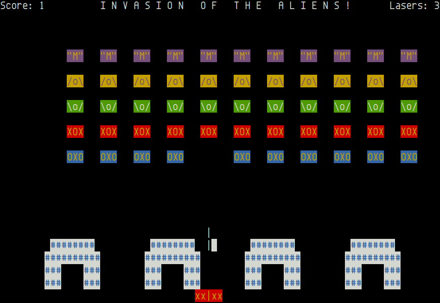

Aliens Attack
=============

This is a UNIX version of Space Invaders, originally made by Jude Miller
in 1979.  Converted to curses by Mark Horton at Bell Labs in 1981.

Screenshot
----------

Download & Build
----------------

The [latest sources][master] are avilable on GitHub.  Download and
unpack in the usual manner.

To build you need ncurses, a C compiler, and make.  On Ubuntu or other
Debian GNU/Linux based systems you can get this using:

    sudo apt install build-essential libncurses5-dev

Other Linux systems have similar packages.  On FreeBSD you don't need
anything in particular as long as you can fetch the tarball and have
a working `cc` and `make`.

[master]: https://github.com/troglobit/aliens/archive/master.tar.gz
